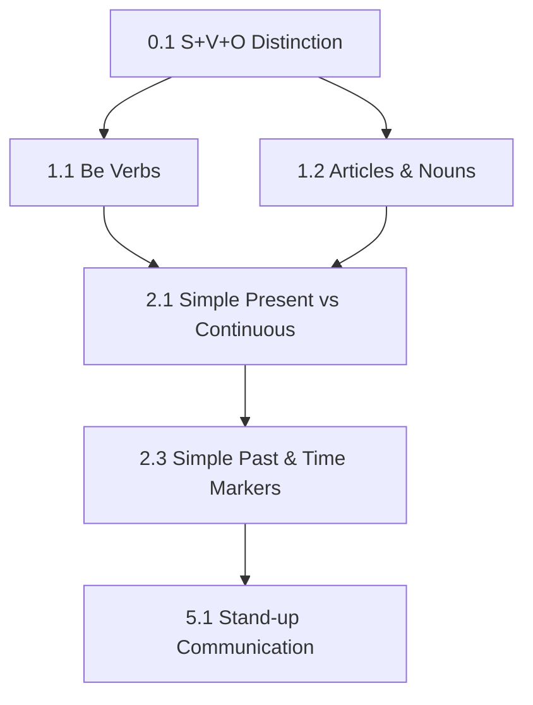

# Curriculum Topic Dependencies

## Prerequisite Mapping

```mermaid
graph TD
    A["0.1 S+V+O Distinction"] --> B["1.1 Be Verbs"]
    A --> C["1.2 Articles & Nouns"]
    B --> D["2.1 Simple Present vs Continuous"]
    C --> D
    D --> E["2.3 Simple Past & Time Markers"]
    E --> F["5.1 Stand-up Communication"]
```
